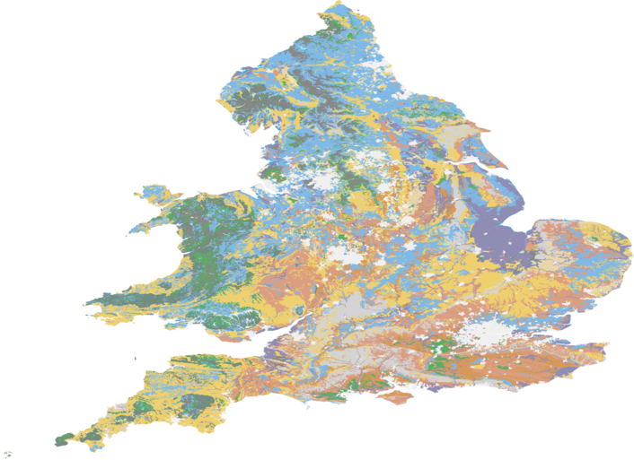

# Flood Risk Prediction tool

## Deadlines
-  *code 12pm GMT Friday 25th November 2022*
-  *presentation/ one page report 4pm GMT Friday 25th November 2022*

### Key Requirements

Your project must provide the following:

 - at least one analysis method to estimate a number of properties for unlabelled postcodes extrapolated from sample data which is provided to you:
    - Flood risk (on a 10 point scale).
    - Median house price.
 - at least one analysis method to estimate the Local Authority & flood risk of arbitrary locations. 
 - a method to find the rainfall and water level near a given postcode from provided rainfall, river and tide level data, or by looking online.

 You should also provide visualization and analysis tools for the postcode, rainfall, river & tide data provided to you, ideally in a way which will identify potential areas at immediate risk of flooding.
 
 Your code should have installation instructions and basic documentation, either as docstrings for functions & class methods, a full manual or both.




This README file *should be updated* over the course of your group's work to represent the scope and abilities of your project.

### Assessment

 - your code will be assessed for its speed (both at training and prediction) & accuracy.
 - Your code should include tests of its functionality.
 - Additional marks will be awarded for high code quality and a clean, well organised repository.

 ### Installation Guide

*To be written by you during the week*

### User instructions

#### Risk Tool
The tool.py file combines the main functionality of the flood risk tool. 
<br>
The first step to use the tool is to import tool from flood_tool and initialise the class: 
* import tool from flood_tool
* tool = tool.Tool()

Then train all models that can be used by giving a labelled set of samples:
* tool.train(LABELLED_DATA_PATH)

See below for a description of the main functionality in tool.py and an example on how to use it. 

1. Convert between UK ordanance survey easting/northing coordinates, GPS latitude & longitude, and postcode.
   - To find eastings and northings from postcode:
      - tool.get_easting_northing(postcodes=['BN1 5PF'])
   - To find latitude and longitude from postcode:
      - tool.get_lat_long(postcodes=['BN1 5PF'])
   - To find postcode from easting and northing:
      - tool.get_postcode_from_OSGB36(eastings=[417997.0], northings=[97342.0])
   - To find postcode from latitude and longitude:
      - tool.get_postcodes_from_WGS84(latitudes=[50], longitudes=[0])

2. Predict the Local Authority for arbitrary locations (use tool.get_local_authority_methods() to see available methods).
   - tool.get_local_authority_estimate(eastings=[417997.0, 535049.0], northings=[97342.0, 169939.0], method=1)

3. Predict the median house price for input postcodes (use tool.get_house_price_methods() to see available methods).
   - tool.get_median_house_price_estimate(postcodes=['BN1 5PF'], method=1)

4. Predict flood probability for input postcodes or arbitrary locations (use tool.get_flood_class_from_locations_methods() to see available methods)
   - tool.get_flood_class_from_postcodes(postcodes=['BN1 5PF'], method=1)
   - tool.get_flood_class_from_OSGB36_locations(eastings=[417997.0, 535049.0], northings=[97342.0, 169939.0], method=1)
   - tool.get_flood_class_from_WGS84_locations(longitudes=[0], latitudes=[50], method=1)

5. Predict flood risk for input postcodes or arbitrary locations.
   - tool.get_annual_flood_risk(postcodes['BN1 5PF'])
   - tool.get_annual_flood_risk_from_WGS84(longitudes=[0], latitudes=[50])
   - tool.get_annual_flood_risk_from_OSGB36(eastings=[417997.0, 535049.0], northings=[97342.0, 169939.0])

#### Data Visualiser
1. In the command line run 'python DataVisualisation.py'.
2. Open file 'a_map.html' and jump to the online interactive map.
3. Click on the buttons to visualise different parameters.


### Documentation

_This section should be updated during the week._

The code includes [Sphinx](https://www.sphinx-doc.org) documentation. On systems with Sphinx installed, this can be build by running

```
python -m sphinx docs html
```

then viewing the generated `index.html` file in the `html` directory in your browser.

For systems with [LaTeX](https://www.latex-project.org/get/) installed, a manual pdf can be generated by running

```bash
python -m sphinx  -b latex docs latex
```

Then following the instructions to process the `FloodTool.tex` file in the `latex` directory in your browser.

### Testing

The tool includes several tests, which you can use to check its operation on your system. With [pytest](https://doc.pytest.org/en/latest) installed, these can be run with

```bash
python -m pytest --doctest-modules flood_tool
```

### Reading list

 - (A guide to coordinate systems in Great Britain)[https://webarchive.nationalarchives.gov.uk/20081023180830/http://www.ordnancesurvey.co.uk/oswebsite/gps/information/coordinatesystemsinfo/guidecontents/index.html]

 - (Information on postcode validity)[https://assets.publishing.service.gov.uk/government/uploads/system/uploads/attachment_data/file/283357/ILRSpecification2013_14Appendix_C_Dec2012_v1.pdf]
